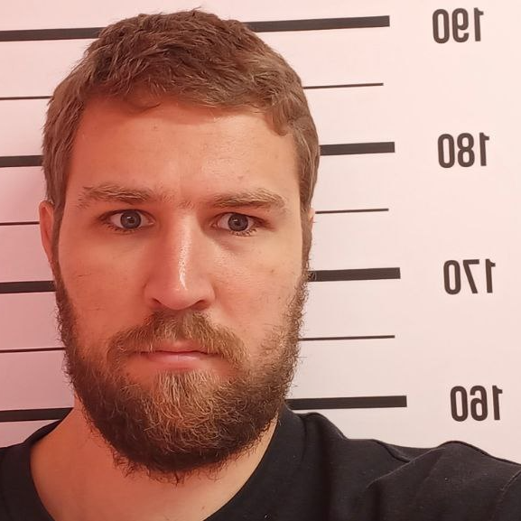

[def1]: https://www.coursera.org/account/accomplishments/verify/TYAQ83BBQAWT
[def2]: https://www.linkedin.com/in/alexander-romanyuk-71663b84/

This is cv.md file from my computer!
Hello World!

1. **Aliaksandr Ramaniuk**
2. contact information:
    * *email: fpm.romanyuk@gmail.com*
    * *tel. +48 572-427-107*
    * discord: smith6079
3. One goal, is to return to IT, after 10 years of sleeping.
4. [Google Search](https://www.google.com/)
5. Code in C++
```
    #using namespace std;

    int main () {
        cout << "Hello World";

        return 0;
    }
```
6. **Work experience**
- С++: I worked for a couple of months in C++.
- C# (.Net): I worked for a couple of months on EPAM, on .Net.
- [RS School](https://github.com/Smith6079/rsschool-cv)
- [LinkedIn][def2]
7. Education:
    - Belarusian State University, Faculty of Applied Mathematics and Informatics
    - EPAM .Net courses
    - [coursera Google Career Certificates Foundations of Digital Marketing and E-commerce / Course 1 of 7][def1]
8. English... let's get started:
- Streamline: Course A2 and B1.
- CAMBLY: Conversation practice with native speakers.
- Duolingo: Practice for 5 minutes every day.
- I'm listening podcasts: [Lex Fridman](https://www.youtube.com/@lexfridman), [Andrew Huberman](https://www.youtube.com/@hubermanlab), [Sam Harris](https://www.youtube.com/@samharrisorg), etc.